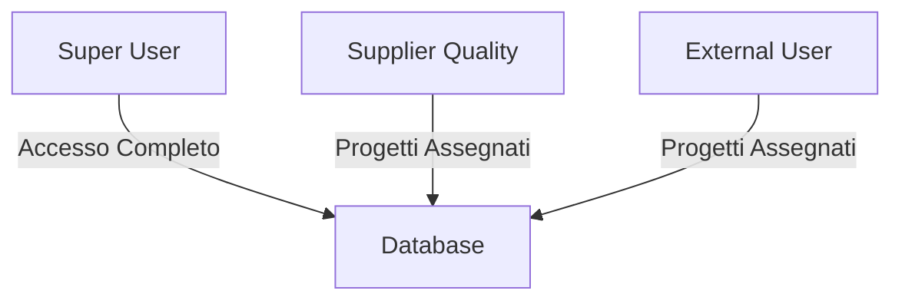
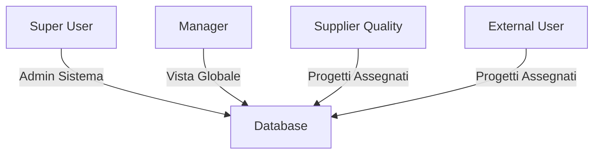

# 📋 Piano di Sviluppo: Implementazione Ruolo Manager
## GeoGrowth Platform - Sistema di Gestione Ruoli Avanzato

---

## 📌 Executive Summary

### Obiettivo
Implementare un ruolo "Manager" intermedio che permetta visibilità completa sui progetti e action plans senza fornire privilegi amministrativi completi, migliorando la sicurezza e la scalabilità del sistema.

### Benefici Chiave
- **Sicurezza**: Separazione netta tra privilegi amministrativi e operativi
- **Scalabilità**: Facile gestione di team in crescita
- **Compliance**: Audit trail migliorato e principio del least privilege
- **Efficienza**: Dashboard e report dedicati per decisioni rapide

### Timeline Stimata
- **Fase 1**: 2-3 giorni (Implementazione base)
- **Fase 2**: 3-4 giorni (Dashboard e UI)
- **Fase 3**: 2-3 giorni (Testing e deployment)
- **Totale**: 7-10 giorni lavorativi

---

## 🎯 Analisi del Requisito

### Situazione Attuale


**Problematiche**:
- Super User ha troppi privilegi per task operativi quotidiani
- Nessuna visibilità cross-project per manager non-admin
- Difficoltà nel monitoraggio globale degli action plans urgenti

### Situazione Target


---

## 🏗️ Architettura Proposta

### Gerarchia dei Ruoli

| Ruolo | Livello | Visibilità Progetti | Action Plans | Admin Functions |
|-------|---------|-------------------|--------------|-----------------|
| Super User | 4 | Tutti | Tutti + CRUD completo | ✅ Sì |
| Manager | 3 | Tutti | Tutti (Read + Update propri) | ❌ No |
| Supplier Quality | 2 | Assegnati | Assegnati + CRUD | ❌ No |
| External User | 1 | Assegnati | Assegnati (Read only) | ❌ No |

### Matrice dei Permessi Dettagliata

#### Projects
| Operazione | Super User | Manager | Supplier Quality | External User |
|------------|------------|---------|------------------|---------------|
| View All | ✅ | ✅ | ❌ | ❌ |
| View Assigned | ✅ | ✅ | ✅ | ✅ |
| Create | ✅ | ❌ | ❌ | ❌ |
| Update | ✅ | ❌ | ✅ (assigned) | ❌ |
| Delete | ✅ | ❌ | ❌ | ❌ |

#### Action Plans
| Operazione | Super User | Manager | Supplier Quality | External User |
|------------|------------|---------|------------------|---------------|
| View All | ✅ | ✅ | ❌ | ❌ |
| View Assigned | ✅ | ✅ | ✅ | ✅ |
| Create | ✅ | ✅ | ✅ | ❌ |
| Update Any | ✅ | ❌ | ✅ (assigned) | ❌ |
| Update Own | ✅ | ✅ | ✅ | ✅ (limited) |
| Delete | ✅ | ❌ | ✅ (assigned) | ❌ |

---

## 💾 Implementazione Database

### Fase 1: Struttura Dati

#### 1.1 Creazione Ruolo Manager
```sql
-- Inserimento nuovo ruolo
INSERT INTO user_roles (role_name, role_description, priority_level) 
VALUES (
    'Manager', 
    'Operational manager with global visibility on projects and action plans',
    3  -- Livello priorità tra Super User (4) e Supplier Quality (2)
);

-- Indice per performance
CREATE INDEX idx_user_roles_priority ON user_roles(priority_level);
```

#### 1.2 Funzioni di Supporto
```sql
-- Funzione per verificare se utente è manager
CREATE OR REPLACE FUNCTION is_manager()
RETURNS boolean
LANGUAGE plpgsql
SECURITY DEFINER
STABLE
AS $$
BEGIN
    RETURN EXISTS (
        SELECT 1 
        FROM user_role_assignments ura
        JOIN user_roles ur ON ura.role_id = ur.id
        WHERE ura.user_id = auth.uid()
        AND ur.role_name IN ('Manager', 'Super User')
    );
END;
$$;

-- Funzione per ottenere il livello di ruolo massimo dell'utente
CREATE OR REPLACE FUNCTION get_user_max_role_level()
RETURNS integer
LANGUAGE plpgsql
SECURITY DEFINER
STABLE
AS $$
BEGIN
    RETURN COALESCE(
        (SELECT MAX(ur.priority_level)
         FROM user_role_assignments ura
         JOIN user_roles ur ON ura.role_id = ur.id
         WHERE ura.user_id = auth.uid()),
        0
    );
END;
$$;
```

### Fase 2: Row Level Security (RLS)

#### 2.1 Policy per Action Plans
```sql
-- Drop policy esistente
DROP POLICY IF EXISTS "Allow read access on action_plans" ON action_plans;

-- Nuova policy con supporto Manager
CREATE POLICY "Allow read access on action_plans" 
ON action_plans 
FOR SELECT 
TO authenticated
USING (
    -- Manager e Super User vedono tutto
    get_user_max_role_level() >= 3
    OR
    -- Altri vedono solo progetti assegnati
    EXISTS (
        SELECT 1
        FROM parent_components pc
        WHERE pc.id = action_plans.parent_component_id 
        AND is_assigned_to_project(pc.project_id)
    )
);

-- Policy per UPDATE differenziata
DROP POLICY IF EXISTS "Allow updates on action_plans" ON action_plans;

CREATE POLICY "Allow updates on action_plans"
ON action_plans
FOR UPDATE
TO authenticated
USING (
    -- Super User può modificare tutto
    has_role('Super User'::text)
    OR
    -- Manager può modificare i propri
    (has_role('Manager'::text) AND created_by_user_id = auth.uid())
    OR
    -- Supplier Quality sui progetti assegnati
    (has_role('Supplier Quality'::text) AND EXISTS (
        SELECT 1 FROM parent_components pc
        WHERE pc.id = action_plans.parent_component_id 
        AND is_assigned_to_project(pc.project_id)
    ))
);
```

#### 2.2 Policy per Projects
```sql
DROP POLICY IF EXISTS "Allow read access on projects" ON projects;

CREATE POLICY "Allow read access on projects" 
ON projects 
FOR SELECT 
TO authenticated
USING (
    -- Manager e superiori vedono tutto
    get_user_max_role_level() >= 3
    OR
    -- Altri vedono solo assegnati
    is_assigned_to_project(id)
);
```

### Fase 3: Viste Dedicate

#### 3.1 Vista Dashboard Manager
```sql
CREATE OR REPLACE VIEW v_manager_dashboard AS
WITH action_plan_stats AS (
    SELECT 
        pc.project_id,
        COUNT(*) FILTER (WHERE ap.action_plan_status IN ('Open', 'In Progress')) as open_count,
        COUNT(*) FILTER (WHERE ap.due_date < CURRENT_DATE AND ap.action_plan_status IN ('Open', 'In Progress')) as overdue_count,
        COUNT(*) FILTER (WHERE ap.due_date = CURRENT_DATE AND ap.action_plan_status IN ('Open', 'In Progress')) as due_today_count,
        COUNT(*) FILTER (WHERE ap.due_date BETWEEN CURRENT_DATE + 1 AND CURRENT_DATE + 7 AND ap.action_plan_status IN ('Open', 'In Progress')) as due_week_count
    FROM action_plans ap
    JOIN parent_components pc ON ap.parent_component_id = pc.id
    GROUP BY pc.project_id
)
SELECT 
    p.id as project_id,
    p.project_name,
    p.project_status,
    p.project_priority,
    COALESCE(aps.open_count, 0) as open_action_plans,
    COALESCE(aps.overdue_count, 0) as overdue_action_plans,
    COALESCE(aps.due_today_count, 0) as due_today_action_plans,
    COALESCE(aps.due_week_count, 0) as due_week_action_plans,
    CASE 
        WHEN COALESCE(aps.overdue_count, 0) > 0 THEN 'at_risk'
        WHEN COALESCE(aps.due_today_count, 0) > 0 THEN 'attention_needed'
        ELSE 'on_track'
    END as project_health
FROM projects p
LEFT JOIN action_plan_stats aps ON p.id = aps.project_id
WHERE p.project_status != 'Cancelled';

-- Grant access
GRANT SELECT ON v_manager_dashboard TO authenticated;
```

#### 3.2 Vista Action Plans Prioritari
```sql
CREATE OR REPLACE VIEW v_priority_action_plans AS
SELECT 
    ap.id,
    ap.action_plan_description,
    ap.action_plan_status,
    ap.due_date,
    ap.priority_level,
    p.project_name,
    pc.calculated_parent_status,
    d.item_code,
    d.component_description,
    u_resp.full_name as responsible_user_name,
    u_resp.email as responsible_user_email,
    CASE 
        WHEN ap.due_date < CURRENT_DATE THEN 'overdue'
        WHEN ap.due_date = CURRENT_DATE THEN 'due_today'
        WHEN ap.due_date <= CURRENT_DATE + 7 THEN 'due_soon'
        ELSE 'future'
    END as urgency_status,
    ap.due_date - CURRENT_DATE as days_until_due
FROM action_plans ap
JOIN parent_components pc ON ap.parent_component_id = pc.id
JOIN projects p ON pc.project_id = p.id
JOIN drawings d ON pc.drawing_id = d.id
LEFT JOIN users u_resp ON ap.responsible_user_id = u_resp.id
WHERE ap.action_plan_status IN ('Open', 'In Progress')
ORDER BY 
    CASE 
        WHEN ap.due_date < CURRENT_DATE THEN 0
        WHEN ap.due_date = CURRENT_DATE THEN 1
        ELSE 2
    END,
    ap.priority_level DESC,
    ap.due_date ASC;

GRANT SELECT ON v_priority_action_plans TO authenticated;
```

---

## 🎨 Implementazione Frontend

### Fase 1: Hook e Context

#### 1.1 Hook useUserRole
```typescript
// hooks/useUserRole.ts
import { useState, useEffect } from 'react';
import { supabase } from '@/lib/supabaseClient';

export interface UserRole {
  id: number;
  role_name: string;
  priority_level: number;
}

export function useUserRole() {
  const [roles, setRoles] = useState<UserRole[]>([]);
  const [isManager, setIsManager] = useState(false);
  const [loading, setLoading] = useState(true);

  useEffect(() => {
    const fetchUserRoles = async () => {
      const { data, error } = await supabase
        .from('user_role_assignments')
        .select(`
          user_roles (
            id,
            role_name,
            priority_level
          )
        `)
        .eq('user_id', (await supabase.auth.getUser()).data.user?.id);

      if (data) {
        const userRoles = data.map(d => d.user_roles).filter(Boolean);
        setRoles(userRoles);
        setIsManager(userRoles.some(r => 
          r.role_name === 'Manager' || r.role_name === 'Super User'
        ));
      }
      setLoading(false);
    };

    fetchUserRoles();
  }, []);

  return { roles, isManager, loading };
}
```

#### 1.2 Componente Dashboard Manager
```typescript
// components/dashboard/ManagerDashboard.tsx
import { useUserRole } from '@/hooks/useUserRole';
import { ManagerStatsCard } from './ManagerStatsCard';
import { PriorityActionPlans } from './PriorityActionPlans';
import { ProjectHealthMatrix } from './ProjectHealthMatrix';

export function ManagerDashboard() {
  const { isManager, loading } = useUserRole();

  if (loading) return <DashboardSkeleton />;
  
  if (!isManager) {
    return <RegularUserDashboard />;
  }

  return (
    <div className="space-y-6">
      <h1 className="text-3xl font-bold">Manager Dashboard</h1>
      
      <div className="grid grid-cols-1 md:grid-cols-4 gap-4">
        <ManagerStatsCard title="Total Projects" metric="total_projects" />
        <ManagerStatsCard title="At Risk" metric="projects_at_risk" variant="danger" />
        <ManagerStatsCard title="Overdue Actions" metric="overdue_actions" variant="warning" />
        <ManagerStatsCard title="Due Today" metric="due_today" variant="info" />
      </div>

      <div className="grid grid-cols-1 lg:grid-cols-2 gap-6">
        <PriorityActionPlans limit={10} />
        <ProjectHealthMatrix />
      </div>
    </div>
  );
}
```

### Fase 2: Componenti UI Dedicati

#### 2.1 Filtri Avanzati per Manager
```typescript
// components/filters/ManagerFilters.tsx
interface ManagerFiltersProps {
  onFilterChange: (filters: FilterState) => void;
}

export function ManagerFilters({ onFilterChange }: ManagerFiltersProps) {
  const [filters, setFilters] = useState<FilterState>({
    projects: 'all',
    urgency: 'all',
    responsibleUser: 'all',
    dateRange: 'week'
  });

  return (
    <Card>
      <CardHeader>
        <CardTitle>Global Filters</CardTitle>
      </CardHeader>
      <CardContent>
        <div className="grid grid-cols-2 md:grid-cols-4 gap-4">
          <Select value={filters.projects} onValueChange={(v) => updateFilter('projects', v)}>
            <SelectTrigger>
              <SelectValue placeholder="All Projects" />
            </SelectTrigger>
            <SelectContent>
              <SelectItem value="all">All Projects</SelectItem>
              <SelectItem value="at_risk">At Risk Only</SelectItem>
              <SelectItem value="on_track">On Track Only</SelectItem>
            </SelectContent>
          </Select>
          {/* Altri filtri... */}
        </div>
      </CardContent>
    </Card>
  );
}
```

---

## 🧪 Piano di Testing

### Test Unitari
```typescript
// __tests__/roles/manager-role.test.ts
describe('Manager Role Permissions', () => {
  it('should allow manager to view all projects', async () => {
    const { data } = await supabase
      .from('projects')
      .select('*');
    expect(data.length).toBeGreaterThan(0);
  });

  it('should allow manager to view all action plans', async () => {
    const { data } = await supabase
      .from('v_priority_action_plans')
      .select('*');
    expect(data).toBeDefined();
  });

  it('should prevent manager from deleting projects', async () => {
    const { error } = await supabase
      .from('projects')
      .delete()
      .eq('id', testProjectId);
    expect(error).toBeDefined();
    expect(error.code).toBe('42501'); // Permission denied
  });
});
```

### Test di Integrazione
```typescript
describe('Manager Dashboard Integration', () => {
  it('should load complete dashboard data', async () => {
    // Login come manager
    await loginAsManager();
    
    // Verifica caricamento stats
    await waitFor(() => {
      expect(screen.getByText(/Total Projects/i)).toBeInTheDocument();
    });
    
    // Verifica action plans visibili
    const actionPlans = await screen.findAllByTestId('action-plan-card');
    expect(actionPlans.length).toBeGreaterThan(0);
  });
});
```

### Scenari di Test Manuale

| Scenario | Azioni | Risultato Atteso |
|----------|--------|------------------|
| Login Manager | Login con utente Manager | Dashboard manager visibile |
| Visualizzazione Globale | Navigare a progetti | Tutti i progetti visibili |
| Filtri Dashboard | Applicare filtri urgenza | Solo action plans filtrati |
| Modifica Action Plan | Tentare modifica non propria | Operazione negata |
| Export Report | Esportare report globale | CSV con tutti i dati |

---

## 📊 KPI e Metriche di Successo

### Metriche Tecniche
- **Performance Query**: < 200ms per dashboard load
- **Cache Hit Rate**: > 80% per query ripetute
- **Error Rate**: < 0.1% su operazioni manager

### Metriche di Business
- **Tempo Identificazione Criticità**: -70% (da 15min a 5min)
- **Action Plans Overdue**: -50% entro 3 mesi
- **Utilizzo Dashboard Manager**: > 10 accessi/giorno per manager

### Metriche di Adozione
- **Manager Attivi**: 100% entro 1 mese
- **Feature Utilization**: > 80% delle funzionalità usate
- **User Satisfaction**: > 4.5/5 in survey

---

## 🚀 Piano di Rollout

### Week 1-2: Development
- [ ] Implementazione ruolo database
- [ ] Aggiornamento policies RLS
- [ ] Creazione viste dedicate
- [ ] Test unitari

### Week 2-3: Frontend
- [ ] Hook useUserRole
- [ ] Dashboard Manager
- [ ] Componenti UI dedicati
- [ ] Test integrazione

### Week 3-4: Testing & Refinement
- [ ] UAT con manager selezionati
- [ ] Performance tuning
- [ ] Bug fixing
- [ ] Documentazione utente

### Week 4: Deployment
- [ ] Migration script produzione
- [ ] Rollout graduale (10% → 50% → 100%)
- [ ] Monitoring e support
- [ ] Training manager

---

## ⚠️ Rischi e Mitigazioni

| Rischio | Probabilità | Impatto | Mitigazione |
|---------|-------------|---------|-------------|
| Performance degradation | Media | Alto | Indicizzazione preventiva + caching |
| Confusione ruoli esistenti | Bassa | Medio | Documentazione chiara + training |
| Security breach | Bassa | Alto | Audit policies + penetration test |
| Resistenza al cambiamento | Media | Medio | Coinvolgimento early adopter |

---

## 💰 Analisi Costi-Benefici

### Costi
- **Sviluppo**: 7-10 giorni uomo = ~€3,500-5,000
- **Testing**: 2-3 giorni uomo = ~€1,000-1,500
- **Training**: 1 giorno = ~€500
- **Totale**: ~€5,000-7,000

### Benefici (Annuali)
- **Riduzione tempo supervisione**: 2h/settimana × 52 × €50 = €5,200
- **Prevenzione ritardi**: -3 ritardi/mese × €1,000 = €36,000
- **Efficienza decisionale**: 30min/giorno × 250 × €100 = €12,500
- **Totale**: ~€53,700/anno

### ROI
- **Payback Period**: < 2 mesi
- **ROI Anno 1**: 760%

---

## 📝 Checklist Pre-Deployment

### Database
- [ ] Backup completo database
- [ ] Script rollback preparato
- [ ] Ruolo Manager creato
- [ ] Policies aggiornate
- [ ] Viste create e testate
- [ ] Indici ottimizzati

### Frontend
- [ ] Component Manager Dashboard completo
- [ ] Hook useUserRole testato
- [ ] UI responsive verificata
- [ ] Traduzioni complete (IT/EN)
- [ ] Error handling implementato

### Testing
- [ ] Unit test passed (100%)
- [ ] Integration test passed
- [ ] UAT completato con successo
- [ ] Performance benchmark ok
- [ ] Security audit passed

### Documentazione
- [ ] User guide manager
- [ ] Admin guide
- [ ] API documentation
- [ ] Troubleshooting guide

### Deployment
- [ ] Migration script testato
- [ ] Rollback plan documentato
- [ ] Monitoring setup
- [ ] Alert system configurato
- [ ] Support team briefed

---

## 🎯 Conclusioni e Next Steps

### Immediate Actions (Sprint Corrente)
1. Approvazione piano da stakeholder
2. Creazione branch `feature/manager-role`
3. Implementazione struttura database

### Future Enhancements (Backlog)
1. **Dashboard Analytics Avanzate**: Grafici trend e predittivi
2. **Notifiche Real-time**: WebSocket per alert immediati
3. **Mobile App Manager**: App dedicata per manager in movimento
4. **AI Assistant**: Suggerimenti basati su pattern storici
5. **Integration API**: Webhook per sistemi esterni

### Contatti Progetto
- **Product Owner**: [Da definire]
- **Tech Lead**: [Da definire]
- **QA Lead**: [Da definire]

---

## 📚 Appendici

### A. Query SQL Complete
[Incluse nel documento sopra]

### B. Esempi API Calls
```javascript
// Get manager dashboard stats
const { data } = await supabase
  .rpc('get_manager_dashboard_stats');

// Get priority action plans
const { data } = await supabase
  .from('v_priority_action_plans')
  .select('*')
  .limit(20);
```

### C. Configurazione Ambiente Test
```env
# .env.test
NEXT_PUBLIC_MANAGER_ROLE_ENABLED=true
NEXT_PUBLIC_DASHBOARD_CACHE_TTL=300
NEXT_PUBLIC_MANAGER_FEATURES=analytics,export,bulk_update
```

---

*Documento generato per GeoGrowth Platform*  
*Versione: 1.0*  
*Data: 2025*  
*Classificazione: Internal Use*