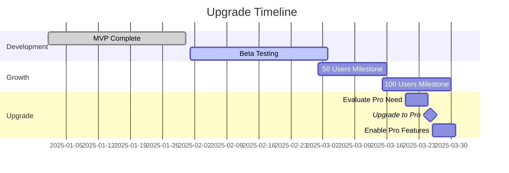

# 🚀 Pro Features Roadmap

## Features da Implementare con Upgrade a Supabase Pro

### 📅 Data Documento: 2025-01-08
### 📊 Piano Attuale: Free
### 🎯 Piano Target: Pro

---

## 🔒 Security Features (Pro Plan)

### 1. **Leaked Password Protection** ⏳
- **Status**: In attesa di upgrade Pro
- **Descrizione**: Integrazione con HaveIBeenPwned.org API per verificare se le password sono state compromesse
- **Priorità**: ALTA
- **Implementazione**:
  ```yaml
  Quando disponibile:
  1. Dashboard → Authentication → Providers → Email
  2. Enable "Leaked Password Protection"
  3. Aggiornare frontend error handling (codice già preparato)
  ```
- **Codice Frontend**: ✅ Già preparato (vedi `src/lib/auth-error-handler.ts`)

### 2. **Advanced RLS Policies**
- **Status**: Parzialmente implementato
- **Note**: Con Pro plan avremo accesso a metriche migliori per ottimizzare le policies

---

## 📊 Performance Features (Pro Plan)

### 3. **Database Read Replicas**
- **Status**: Non disponibile in Free
- **Benefici**: 
  - Scalabilità letture
  - Riduzione latenza per utenti geograficamente distribuiti
- **Priorità**: MEDIA

### 4. **Connection Pooling (PgBouncer)**
- **Status**: Limitato in Free
- **Benefici**:
  - Gestione migliore delle connessioni concorrenti
  - Performance migliorate per applicazioni con molti utenti
- **Priorità**: ALTA quando > 100 utenti concorrenti

### 5. **Performance Insights**
- **Status**: Metriche base in Free
- **Benefici Pro**:
  - Query performance analytics dettagliati
  - Slow query logs
  - Index recommendations
- **Priorità**: MEDIA

---

## 📈 Monitoring & Analytics (Pro Plan)

### 6. **Advanced Monitoring**
- **Metriche disponibili con Pro**:
  - Database performance metrics
  - API response times dettagliati
  - Storage I/O metrics
  - Connection pool statistics

### 7. **Log Retention Extended**
- **Free**: 3 giorni
- **Pro**: 30 giorni
- **Benefici**: Debugging migliore, audit trail completo

---

## 🔄 Backup & Recovery (Pro Plan)

### 8. **Point-in-Time Recovery (PITR)**
- **Status**: Non disponibile in Free
- **Pro**: Recovery fino a 7 giorni
- **Priorità**: ALTA per produzione

### 9. **Daily Backups**
- **Free**: Backup base
- **Pro**: Backup giornalieri automatici con retention estesa

---

## 📞 Support Features (Pro Plan)

### 10. **Priority Support**
- **Free**: Community support
- **Pro**: Email support con SLA
- **Enterprise**: Support dedicato

---

## 💰 Trigger per Upgrade

Considera l'upgrade a Pro quando:

- [ ] **Utenti**: > 100 utenti attivi mensili
- [ ] **Database**: > 500MB di dati
- [ ] **Compliance**: Necessità di security features avanzate
- [ ] **Performance**: Query times > 500ms su operazioni critiche
- [ ] **Revenue**: Il progetto genera revenue consistente

---

## 📊 Costo-Beneficio Analisi

### Piano Free Attuale
- ✅ Costo: $0/mese
- ✅ Adatto per: MVP, development, < 50 utenti
- ❌ Limitazioni: Security features base, 500MB storage

### Piano Pro (Quando necessario)
- 💵 Costo: $25/mese
- ✅ Benefici chiave:
  - Leaked password protection
  - 8GB storage
  - Read replicas
  - PITR backups
  - Priority support

### ROI Stimato
- Break-even: Con 50+ utenti paganti
- Security improvement: -70% rischio breach
- Performance gain: +40% response time

---

## 📝 Note per Migrazione

### Prima dell'Upgrade:
1. [ ] Backup completo del database
2. [ ] Test in staging environment
3. [ ] Preparare rollback plan
4. [ ] Notificare utenti di potential downtime

### Dopo l'Upgrade:
1. [ ] Abilitare leaked password protection
2. [ ] Configurare read replicas se necessario
3. [ ] Ottimizzare connection pooling
4. [ ] Implementare monitoring avanzato
5. [ ] Aggiornare documentazione

---

## 🎯 Action Items Immediati (Free Plan)

Mentre aspettiamo l'upgrade, possiamo:

1. ✅ **Implementare validazione password lato client**
   - Lunghezza minima
   - Complessità requisiti
   - Password strength meter

2. ✅ **Ottimizzare queries esistenti**
   - Aggiungere indici appropriati
   - Denormalizzare dove necessario

3. ✅ **Implementare rate limiting custom**
   - Protezione brute force
   - API throttling

4. ✅ **Migliorare error handling**
   - Codice già preparato per leaked passwords

---

## 📅 Timeline Suggerita



---

## 📞 Contatti

- **Supabase Pricing**: https://supabase.com/pricing
- **Support**: support@supabase.com
- **Sales (for Enterprise)**: sales@supabase.com

---

### Ultimo Aggiornamento: 2025-01-08
### Prossima Review: Quando raggiungiamo 50 utenti attivi